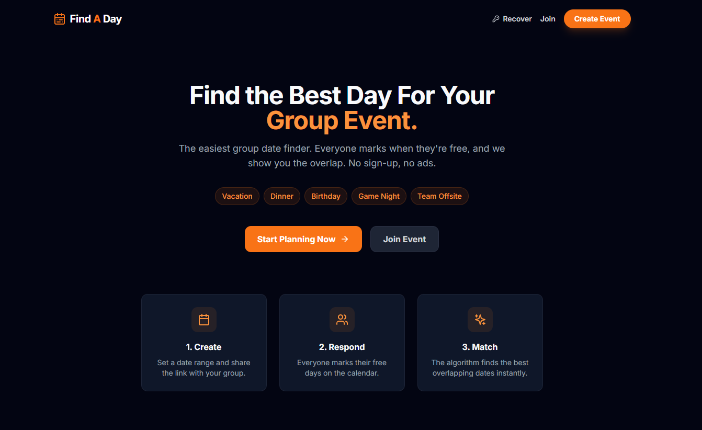
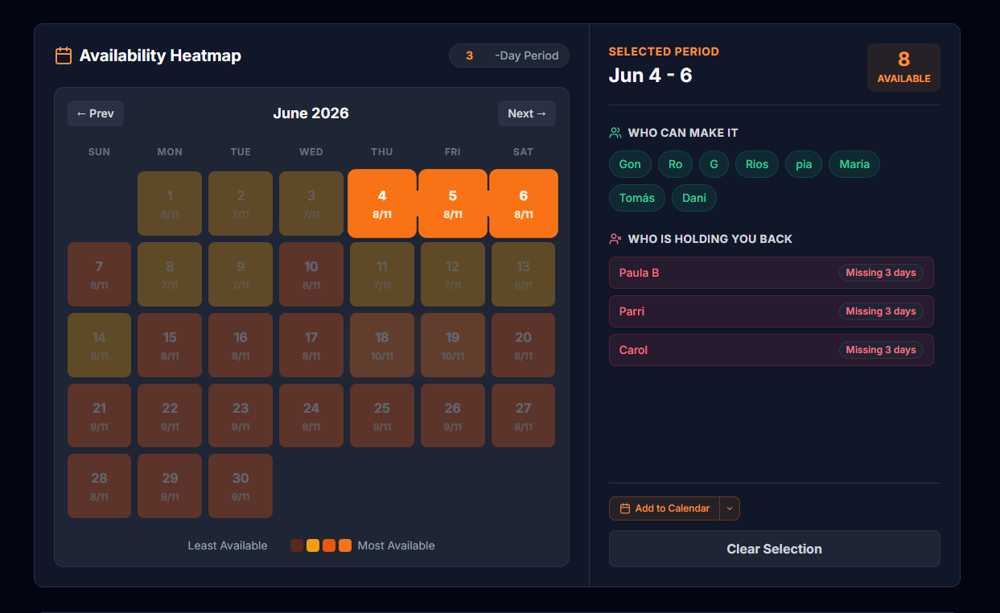

# Find A Day 📅

**Find A Day** is a zero-friction, privacy-first web application designed to eliminate the headache of scheduling group events—from week-long vacations to single-day dinners. 

Unlike Doodle or When2Meet, **Find A Day** is built specifically for **date ranges**, features a modern mobile-first UI, and requires **no account or sign-up** for organizers or participants.



## ✨ Why Find A Day?

*   🚀 **Zero Friction**: No accounts, no sign-ups, no ads. Create a poll and share a link in under 30 seconds.
*   📊 **Visual Heatmaps**: Instantly see which dates work for the most people with an intuitive, color-coded availability grid.
*   🗳️ **Democratic Voting**: Admin proposes top candidate dates, participants vote with live results. The option with the most votes wins—transparent and fair.
*   📍 **Location Smart**: Integrated with Google Places. Add a restaurant, park, or city with autocomplete to help everyone plan better.
*   🗓️ **Built for Ranges**: Perfect for vacations and retreats. Participants paint their availability on a custom calendar, not a messy list of time slots.
*   📱 **Mobile-First**: Designed to work perfectly in your group chat. Every feature is optimized for the phone in your hand.
*   🔐 **Secure Admin**: Manage your group via a unique admin link. Recover access anytime using a secure passphrase or email.
*   📅 **Calendar Invites**: Admin can send the winning date as a calendar invite (ICS file) to all participants—one-click import into any calendar app.



## 🛠️ Technology Stack

*   **Frontend**: React 18, Tailwind CSS, Framer Motion (Animations), Lucide Icons.
*   **Database**: Firebase Realtime Database (Real-time updates without page refreshes).
*   **APIs**: 
    *   **Google Places (New) API**: For location autocomplete and address formatting.
    *   **Vercel Serverless Functions**: For secure backend operations (Express-like `/api` routes).
*   **Email**: Nodemailer (via Vercel functions for invites and recovery).
*   **SEO**: React Helmet Async for dynamic metadata and social previews.

## 🚀 Getting Started

### Prerequisites

*   Node.js 18.x or higher
*   A Firebase project (Realtime Database enabled)
*   Google Cloud Project (with Places API enabled)
*   Gmail account with App Password (for email features)

### Local Installation

1.  **Clone the repository**:
    ```bash
    git clone https://github.com/tomasleote/vacation-scheduler.git
    cd vacation-scheduler
    ```

2.  **Install dependencies**:
    ```bash
    npm install
    ```

3.  **Environment Setup**:
    Create a `.env.local` file in the root directory:
    ```env
    # Firebase Configuration
    REACT_APP_FIREBASE_API_KEY="your_api_key"
    REACT_APP_FIREBASE_AUTH_DOMAIN="your_app.firebaseapp.com"
    REACT_APP_FIREBASE_DATABASE_URL="https://your_app-default-rtdb.firebaseio.com"
    REACT_APP_FIREBASE_PROJECT_ID="your_project_id"
    REACT_APP_FIREBASE_STORAGE_BUCKET="your_app.appspot.com"
    REACT_APP_FIREBASE_MESSAGING_SENDER_ID="your_sender_id"
    REACT_APP_FIREBASE_APP_ID="your_app_id"

    # Google Places
    REACT_APP_GOOGLE_PLACES_API_KEY="your_google_maps_key"

    # Email (for serverless functions)
    EMAIL_SERVICE="gmail"
    EMAIL_USER="your-email@gmail.com"
    EMAIL_PASSWORD="your-app-password"
    ```

4.  **Start development server**:
    ```bash
    npm start
    ```
    The app will run at `http://localhost:3000`.

## 🚢 Deployment

The project is optimized for **Vercel** with zero-config serverless function support.

1.  Push your code to GitHub.
2.  Connect your repository to Vercel.
3.  Add the environment variables in the Vercel Dashboard.
4.  Deploy!

## 🧪 Testing

The codebase includes integration and unit tests using Jest and React Testing Library.

```bash
npm test
```

## 📄 License

This project is licensed under the **MIT License** - see the [LICENSE](LICENSE) file for details.

## 🤝 Contributing

Contributions are what make the open-source community such an amazing place to learn, inspire, and create. Any contributions you make are **greatly appreciated**.

1. Fork the Project
2. Create your Feature Branch (`git checkout -b feature/AmazingFeature`)
3. Commit your Changes (`git commit -m 'Add some AmazingFeature'`)
4. Push to the Branch (`git push origin feature/AmazingFeature`)
5. Open a Pull Request

---

*Made with ❤️ for better group planning.*
